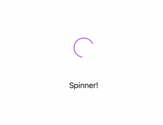

# MaterialDesignSpinner

An iOS activity spinner modeled after Google's Material Design Spinner

[](http://cocoadocs.org/docsets/MaterialDesignSpinner)
[](http://cocoadocs.org/docsets/MaterialDesignSpinner)
[](https://travis-ci.org/e-sites/MaterialDesignSpinner)



> This is the Swift5 version of [MMMaterialDesignSpinner](https://github.com/misterwell/MMMaterialDesignSpinner) by [misterwell](https://github.com/misterwell). Shout out to his solution.

## Installation

### CocoaPods

Podfile:

```ruby
pod 'MaterialDesignSpinner'
```

And then

```
pod install
```

### SwiftPM

Add the following line to your dependencies:

```swift
.package(url: "https://github.com/e-sites/MaterialDesignSpinner.git", .upToNextMajor(from: "1.0.0"))
```


## Implementation

Just add a `MaterialDesignSpinner`to your xib or storyboard.

To change the color use `tintColor`